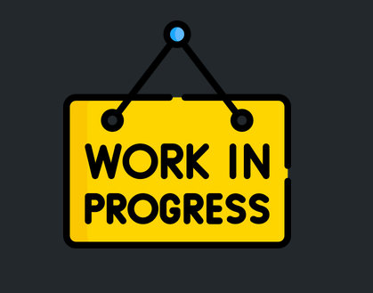

  

+ [What is rest](learning-resources/01_what_is_rest.md)
+ [Rest principle](learning-resources/what-we've-learned.png)
+ [Designing a restful api](learning-resources/02_designing_a_restful_api.md)
+ [Handling more complex scenarios in your API](learning-resources/03_handling_more_complex_scenes.md)
